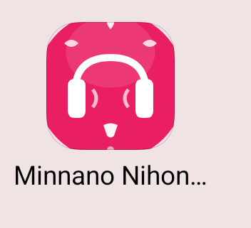
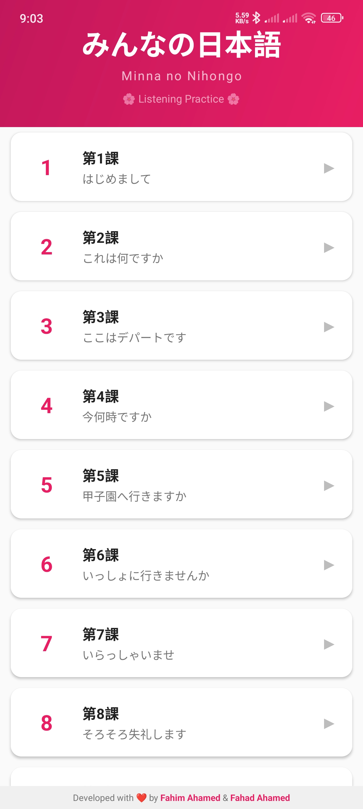
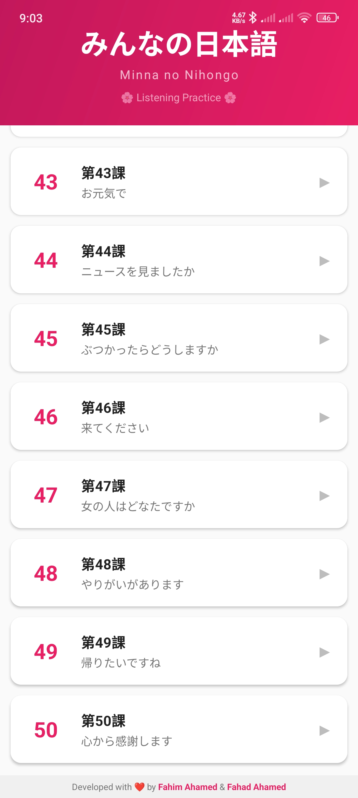
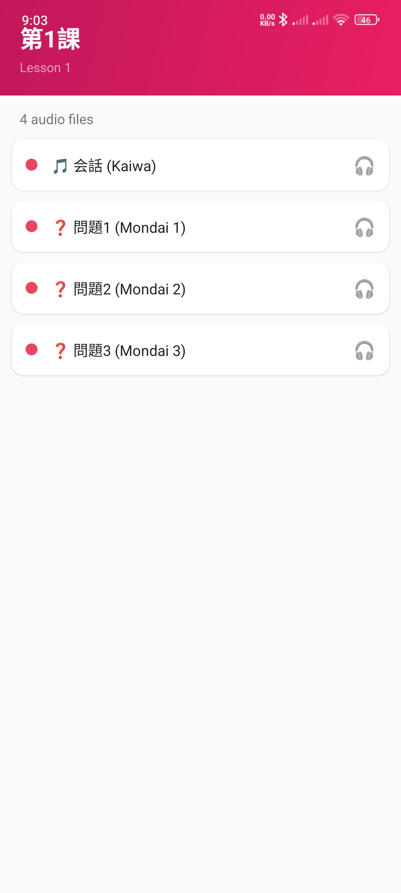
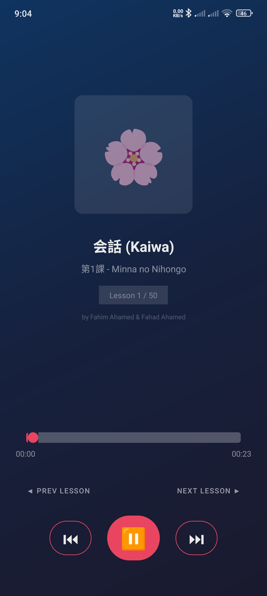

# Minnano Nihongo Listening 🎧🌸

A beautiful Japanese language learning app featuring audio lessons from the popular "Minna no Nihongo" textbook series. Listen to all 50 lessons with continuous auto-play functionality.

## Features

### 🎵 Complete Audio Library
- **50 Lessons** - Complete coverage from Lesson 1 to Lesson 50
- **Multiple Audio Types** - Each lesson includes:
  - 会話 (Kaiwa) - Conversation
  - 問題 (Mondai) - Questions/Exercises
  - 練習 (Renshuu) - Practice (future)
  - 単語 (Tango) - Vocabulary (future)
  - 文法 (Bunpou) - Grammar (future)

### ▶️ Smart Playback
- **Auto-Play** - Continuous playback through all lessons
- **Lesson Navigation** - Jump to previous/next lesson easily
- **Background Play** - Audio continues when screen is off
- **Progress Tracking** - Visual progress bar with time display

### 🌸 Japanese-Style UI
- Beautiful sakura-themed app icon
- Traditional Japanese lesson titles
- Clean, intuitive Material Design interface
- Soft pink color palette

## Screenshots

<p align="center">
  
</p>

<p align="center">
  
  
  
  
</p>

| Screenshot | Description |
|:----------:|-------------|
| **App Icon** | Beautiful sakura-themed headphone icon |
| **Lesson List** | All 50 lessons with Japanese titles |
| **Audio Files** | Multiple audio types per lesson |
| **Player** | Full-featured audio player with auto-play |

## Installation

### From APK
1. Download the latest release APK
2. Enable "Install from unknown sources" in your Android settings
3. Install the APK
4. Start learning Japanese!

### Build from Source
```bash
# Clone the repository
git clone https://github.com/fahimahamed1/Minnano-Nihongo-Listening.git

# Open in Android Studio
# Build > Build Bundle(s) / APK(s) > Build APK(s)

# Or use Gradle
./gradlew assembleRelease
```

## Requirements

- **Android 7.0 (Nougat)** or higher
- Minimum SDK: 24
- Target SDK: 35

## Tech Stack

- **Language:** Java
- **UI:** Material Design Components
- **Architecture:** Android Activity-based
- **Audio:** Android MediaPlayer
- **List Display:** RecyclerView with optimized adapters

## Project Structure

```
app/
├── src/main/
│   ├── java/com/nihongo/app/
│   │   ├── MainActivity.java       # Lesson list
│   │   ├── AudioListActivity.java  # Audio files per lesson
│   │   └── PlayerActivity.java     # Audio player
│   ├── res/
│   │   ├── layout/                 # XML layouts
│   │   ├── drawable/               # Icons & graphics
│   │   ├── mipmap-*/               # App icons
│   │   └── values/                 # Colors, strings, styles
│   └── assets/
│       └── audio/                  # Audio files (lesson_1 to lesson_50)
└── build.gradle
```

## Lessons Overview

The app covers all 50 lessons of Minna no Nihongo:

| Lessons | Topics |
|---------|--------|
| 1-5 | Basic introductions, numbers, time |
| 6-10 | Actions, giving/receiving, adjectives |
| 11-15 | Counting, comparisons, desires |
| 16-20 | How to do things, sequential actions |
| 21-25 | Plain form, opinions, explanations |
| 26-30 | Conditionals, purposes, preparations |
| 31-35 | Intentions, advice, experiences |
| 36-40 | Passive, causative, expressions |
| 41-45 | Giving/receiving favors, preparations |
| 46-50 | Advanced expressions, formal speech |

## Contributing

Contributions are welcome! Please feel free to submit a Pull Request.

1. Fork the repository
2. Create your feature branch (`git checkout -b feature/AmazingFeature`)
3. Commit your changes (`git commit -m 'Add some AmazingFeature'`)
4. Push to the branch (`git push origin feature/AmazingFeature`)
5. Open a Pull Request

## License

This project is licensed under the MIT License - see the [LICENSE](LICENSE) file for details.

## Developers

<table>
  <tr>
    <td align="center">
      <a href="https://facebook.com/fahimahamed4">
        <b>Fahim Ahamed</b>
      </a>
      <br/>
      <a href="https://facebook.com/fahimahamed4">
        
      </a>
    </td>
    <td align="center">
      <a href="https://facebook.com/fahadahamed4">
        <b>Fahad Ahamed</b>
      </a>
      <br/>
      <a href="https://facebook.com/fahadahamed4">
        
      </a>
    </td>
  </tr>
</table>

## Acknowledgments

- Minna no Nihongo textbook series for the excellent learning materials
- The Japanese language learning community
- All contributors and users of this app

---

<p align="center">
  Made with ❤️ for Japanese learners everywhere
  <br/>
  🌸 頑張ってください！(Ganbatte kudasai! - Good luck!) 🌸
</p>
